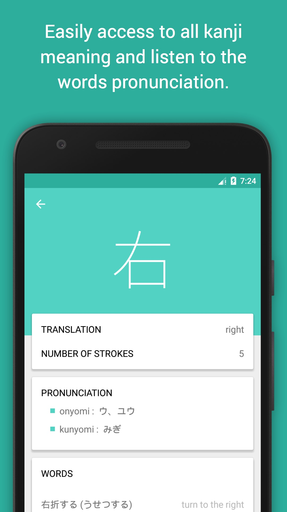

# JLPTN5-Android

 

After having developed the iPhone/iPad application which help people learning kanji 
in a fun way for the JLPT N5 examination, here we are with an Android version.

I took one month and half in March to develop this app and even if it was time consuming, 
I learned a lot and was able to compare things with iOS.

## What I liked :

- The replacement of child views in Android is very easy. With a simple `replace` function using FragmentTransaction, I can update fragments.
- The Scrollview component is neat! I just have to put my content inside and it does its job. In iOS, it's often more complicated. I need to have a content view inside the scrollview, which have this or this layout constraint, etc..
- Making cornier radius is easier on iOS. While in iOS I just have to do something like `view.layer.cornerRadius = 4`, 
it seems that on Android I have to create a file for this, let's call it cornerRadius.xml, and then specifices some properties inside, 
and then use it as a backgroound for my view.
- The store deployment process is far easier in Android. While the App Store process in iOS can take a few days, it takes a few hours on Android. 
What about the updates ? It took me a few minutes to update a new version of my app in Android that resolves a crash to be avaialble for everyone.
- I liked how we can, without much struggle, create interactive animation. Whether it's the use of CoordinatorLayout for parallax effect or activity transition. I used Shared Element Transition that let me create this kind of [content](http://guides.codepath.com/android/shared-element-activity-transition) in less than 5 lines of code.
- This is probably one of the best thing : `R`. Being able to create symbols for images, colors, strings is amazing. In iOS, we are used to access image by their string filename, for example `UIImage(named: "icon_home")`. A typo somewhere and it's a crash.

# Store

If you're curious, the app is available in the [App Store](https://appstore.com/kanjijlptn5) and the [Play Store](play.google.com/store/apps/details?id=com.aymenworks.jlptn5).
# Contact

- Twitter : [aymenworks](twitter.com/aymenworks)
- Mail : [aymenmse@gmail.com](mailto:aymenmse@gmail.com)
- Blog : [aymenworks.com](aymenworks.com)
